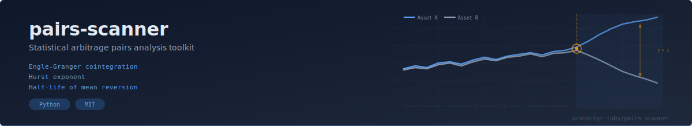
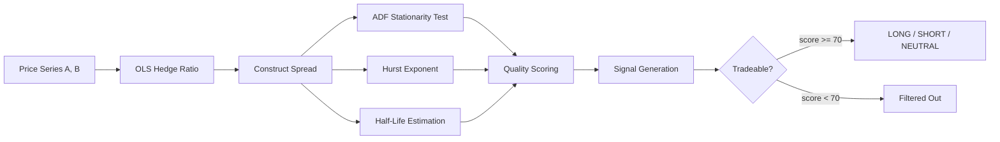

<p align="center">
  
</p>

# pairs-scanner

Quantitative traders, algorithmic developers, and small fund operators use pairs-scanner to find cointegrated asset pairs and generate mean-reversion trading signals. It implements the Engle-Granger two-step method, Hurst exponent estimation, and half-life calculation in a single composable API, so you can screen hundreds of pairs in seconds and focus execution time on the ones that actually mean-revert.

[](https://github.com/protectyr-labs/pairs-scanner/actions)
[](LICENSE)
[](https://python.org)
[]()

## Quick Start

```bash
pip install pairs-scanner            # fallback ADF
pip install "pairs-scanner[full]"    # statsmodels ADF (recommended)
```

```python
import numpy as np
from pairs_scanner import analyze_pair

# Two price series
np.random.seed(42)
base = np.cumsum(np.random.randn(500)) + 100
series_a = base + np.random.randn(500) * 0.5
series_b = base * 1.2 + np.random.randn(500) * 0.5

result = analyze_pair(series_a, series_b, "ETF_A", "ETF_B")
print(f"Quality: {result.quality_score}/100")  # composite tradability score
print(f"Signal:  {result.signal}")             # LONG_SPREAD / SHORT_SPREAD / NEUTRAL
print(f"Tradeable: {result.tradeable}")        # True if quality >= 70
```

## Why This?

- **Rigorous econometrics** -- Engle-Granger cointegration, not just correlation
- **Composite quality score (0-100)** -- combines ADF, Hurst, half-life, correlation, z-score
- **Optional statsmodels** -- uses full ADF when available, simplified fallback when not
- **Batch scanning** -- `scan_pairs(data, pairs, min_quality)` for portfolio-wide screening
- **Actionable signals** -- `LONG_SPREAD`, `SHORT_SPREAD`, or `NEUTRAL` with configurable thresholds

## Scanning Pipeline



## Use Cases

**Quantitative trading research** -- Screen pairs of stocks/ETFs for cointegration. Find tradeable pairs with mean-reverting spreads and reasonable half-lives.

**Risk management** -- Monitor existing pair positions. When the spread z-score exceeds thresholds, generate entry/exit signals.

**Academic research** -- Test cointegration hypotheses across asset classes (equities, crypto, commodities). The quality score provides a standardized comparison metric.

## What the Metrics Mean

| Metric | What It Tells You |
|--------|-------------------|
| **ADF test** (p < 0.05) | Spread is stationary, not a random walk |
| **Hurst exponent** (H < 0.5) | Mean-reverting; H > 0.5 = trending (dangerous) |
| **Half-life** | Days for spread to revert halfway; 1-30 = practical |
| **Z-score** | Standard deviations from mean; \|z\| > 2 = entry signal |
| **Quality score** | Weighted composite: ADF(30) + Hurst(25) + half-life(20) + corr(15) + signal(10) |

## API

| Function | Purpose |
|----------|---------|
| `analyze_pair(a, b, name_a, name_b, zscore_entry, zscore_exit)` | Full analysis returning `PairAnalysis` |
| `scan_pairs(data, pairs, min_quality)` | Batch scan, sorted by quality score |
| `adf_test(series)` | `(statistic, p_value)` -- statsmodels or fallback |
| `hurst_exponent(series)` | Float in [0, 1] |
| `compute_spread(a, b)` | `(spread, hedge_ratio, half_life)` via OLS |

### PairAnalysis Fields

`correlation`, `hedge_ratio`, `half_life_days`, `hurst_exponent`, `is_mean_reverting`, `adf_statistic`, `adf_pvalue`, `is_cointegrated`, `spread_zscore`, `signal`, `quality_score`, `tradeable`

## Design Decisions

**Engle-Granger over Johansen.** For bivariate pairs trading, Engle-Granger is simpler, faster, and equally powerful. The two-step approach (OLS then ADF on residuals) maps directly to the trading strategy: OLS gives the hedge ratio, ADF confirms tradeability. Johansen adds eigenvalue decomposition without improving the bivariate case.

**Hurst as a second opinion.** ADF produces a binary outcome at a chosen significance level. The Hurst exponent provides a continuous measure of mean-reversion strength, catching cases where ADF is marginal. A pair passing both tests is more robust than one passing only one.

**Weighted quality scoring.** No single metric captures tradeability. The 30/25/20/15/10 weighting reflects practical importance: cointegration is necessary (30), mean-reversion confirms it (25), half-life must be practical (20), correlation provides economic intuition (15), current signal is a bonus (10). The 70-point threshold requires cointegration + mean-reversion + at least one more factor.

**OLS hedge ratio.** The simplest and most interpretable estimator for screening. More sophisticated approaches (Kalman filter, total least squares) belong in the execution layer, not the scanning stage.

**Optional statsmodels.** The recommended path includes statsmodels for production-grade ADF with proper lag selection and MacKinnon critical values. The fallback uses simplified regression with approximate critical values -- less precise, but sufficient for screening and keeps the dependency footprint minimal.

> [!NOTE]
> Full architecture rationale is in [ARCHITECTURE.md](ARCHITECTURE.md), including known limitations around linear cointegration assumptions, regime change detection, and transaction cost modeling.

## Limitations

- **Assumes linear cointegration** -- non-linear relationships are not detected
- **No regime change detection** -- a pair that was cointegrated may stop being so
- **No transaction costs** -- quality score does not factor in fees or slippage
- **Lookback-dependent** -- results change with different history lengths

## Origin

Built at [Protectyr Labs](https://github.com/protectyr-labs) as an internal tool for screening equity and ETF pairs. Extracted into a standalone library because the Engle-Granger + Hurst + half-life pipeline kept getting reimplemented across projects.

## License

MIT
